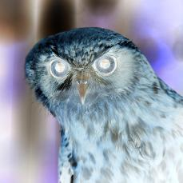
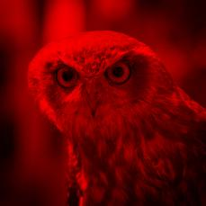
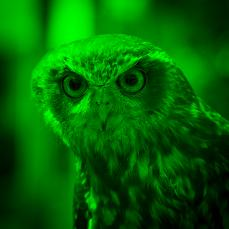
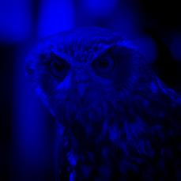

# Image

Repository with filters for image.

## Table of contents
1. [Mirror image](#mirror-image)
2. [Gray filter](#gray-filter)
3. [Sepia filter](#sepia-filter)
4. [Inverse filter](#inverse-filter)
5. [Split image to RGB channels](#split-image-to-rgb-channels)


## Mirror image

Function `mirror` get 3 parameters:

```
func mirror(img: BuffereImage, ox: Boolean, oy: Boolean): BuffereImage
```

- `img` - Image object
- `ox` - if `true` when image mirrored horizontally
- `oy` - if `true` when image mirrored vertically

### Simple usage

```
$ git clone https://github.com/janczer/filters
$ cd filters
$ scala mirror.scala
```

And you will have one file `mirror.jpg`.


## Gray filter

Function gray get 2 parameters:

```
def gray(img: BufferedImage, typ: String): BufferedImage
```

- `img` - Image object
- `typ` - type of filter gray (avarage, lightness, luminosity)

### Simple usage

```
$ git clone https://github.com/janczer/filters
$ cd filters
$ scala gray.scala
```

And you will have one file `gray.jpg`.


## Sepia filter

Sepia filter work on gray scale images.

Function sepia get 2 parameters:

```
def gray(img: BufferedImage, sp: Int): BufferedImage
```

- `img` - Image object
- `sp` - factor of sepia effect (20-40)

### Simple usage

```
$ git clone https://github.com/janczer/filters
$ cd filters
$ scala sepia.scala
```

And you will have one file `sepia.jpg`.


## Inverse filter

Function inverse get 1 parameters:

```
def inverse(img: BufferedImage): BufferedImage
```

- `img` - Image object

### Simple usage

```
$ git clone https://github.com/janczer/filters
$ cd filters
$ scala inverse.scala
```

And you will have one file `inverse.jpg`.




## Split image to RGB channels

Function rgb get 3 parameters:

```
def rgb(img: BufferedImage, r: Boolean, g: Boolean, b: Boolean): BufferedImage
```

- `img` - Image object
- `r` - Show only red channel
- `g` - Show only green channel
- `b` - Show only blue channel

### Simple usage

```
$ git clone https://github.com/janczer/filters
$ cd filters
$ scala rgb.scala
```

And you will have 3 files `red.jpg`, `green.jpg` and `blue.jpg`.





