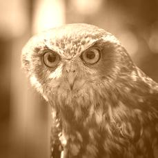

[](https://travis-ci.org/janczer/filters)

# Image

Repository with filters for image.

## Simple usage

First you should clone and compile the project.

```Bash
$ git clone https://github.com/janczer/filters
$ cd filters
$ sbt compile
$ sbt package
```

After that you will have file `filters_2.12-X.X.jar` in `target/scala-2.12/`.

Simple script for test this library:

```Scala
import janczer.filters.Filters
import java.io.File
import javax.imageio.ImageIO

def test() {
  val photoIn = ImageIO.read(new File("test.jpg"))

  ImageIO.write(Filters.mirror(photoIn, true, true), "jpg", new File("mirror.jpg"))
}

test()
```

This is the way how you can run it:

```Scala
$ scala -classpath "filters_2.12-0.2.jar" test.scala
```

## Table of contents
1. [Mirror image](#mirror-image)
2. [Gray filter](#gray-filter)
3. [Sepia filter](#sepia-filter)
4. [Inverse filter](#inverse-filter)
5. [Split image to RGB channels](#split-image-to-rgb-channels)
6. [Color accent filter](#color-accent-filter)
7. [Histogram](#histogram)
8. [Median filter](#median-filter)
9. [Noise filter](#noise-filter)
10. [Sort zig zag](#sort-zig-zag)


## Mirror image

Function `mirror` get 3 parameters:

```Scala
def mirror(img: BuffereImage, ox: Boolean, oy: Boolean): BuffereImage
```

- `img` - Image object
- `ox` - if `true` when image mirrored horizontally
- `oy` - if `true` when image mirrored vertically

And you will have one file `mirror.jpg`.

| Original | ox=true, oy = false | ox = false, oy = true| ox = true, oy = true |
| -------- | ------------------- | -------------------- | -------------------- |
|  | | |  |

## Gray filter

Function gray get 2 parameters:

```Scala
def gray(img: BufferedImage, typ: String): BufferedImage
```

- `img` - Image object
- `typ` - type of filter gray (avarage, lightness, luminosity)

And you will have one file `gray.jpg`.

| Original | Avarage | Lightness | luminosity |
| -------- | ------------------- | -------------------- | -------------------- |
|  |  |  | |  

## Sepia filter

Sepia filter work on gray scale images.

Function sepia get 2 parameters:

```Scala
def sepia(img: BufferedImage, sp: Int): BufferedImage
```

- `img` - Image object
- `sp` - factor of sepia effect (20-40)

And you will have one file `sepia.jpg`.

| Original | Factor 20 | Factor 40|
| -------- | ------------------- | -------------------- |
|  |  |  |

## Inverse filter

Function inverse get 1 parameter:

```Scala
def inverse(img: BufferedImage): BufferedImage
```

- `img` - Image object

And you will have one file `inverse.jpg`.

| Original | Inverse |
| -------- | ------------------- |
|  |  |

## Split image to RGB channels

Function rgb get 3 parameters:

```Scala
def rgb_channels(img: BufferedImage, r: Boolean, g: Boolean, b: Boolean): BufferedImage
```

- `img` - Image object
- `r` - Show only red channel
- `g` - Show only green channel
- `b` - Show only blue channel

And you will have 3 files `red.jpg`, `green.jpg` and `blue.jpg`.

| Original | Only red | Only green | Only blue |
| -------- | ------------------- | -------------------- | --------------------- |
|  |  |  |  |

## Color accent filter

Function color_accent get 3 parameters:

```Scala
def color_accent(img: BufferedImage, hue: Int, range: Int): BufferedImage
```

- `img` - Image object
- `hue` - Color in HSV
- `range` - Range around color `hue`

| Original | Hue = 0, Range = 50 | Hue = 70, Range = 50 | Hue = 200, Range = 50 |
| -------- | ------------------- | -------------------- | --------------------- |
|  |  |  |  |

## Histogram

Function histogram get 1 parameter:

```Scala
def histogram(img: BufferedImage, grid: Boolean): BufferedImage
```

- `img` - Image object
- `grid` - If true image will be have grid

| Original | Histogram |
| -------- | ------------------- |
|  |  |
|  |  |
|  |  |

## Median filter

Function median get 1 parameter:

```Scala
def median(img: BufferedImage): BufferedImage
```

- `img` - Image object

| Original | Median filter |
| -------- | ------------------- |
|  |  |

## Noise filter

Function noise get 1 parameter:

```Scala
def noise(img: BufferedImage): BufferedImage
```

- `img` - Image object

| Original | Noise filter |
| -------- | ------------------- |
|  |  |


## Sort zig zag

More about this filter you can read on my [blog](https://janczer.github.io/zig-zag-filter/).

Function sort_zig_zag get 2 parameters:

```Scala
def sort_zig_zag(img: BufferedImage, gray: Boolean): BufferedImage
```

- `img` - Image object
- `gray` - if true then function transfor image to gray

| Original | color | gray |
| -------- | ------------------- | --- |
|  |  |  |
